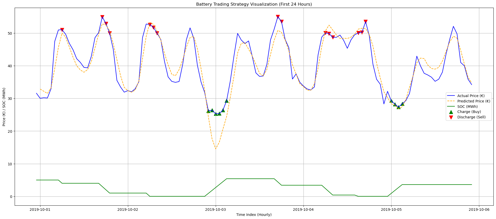
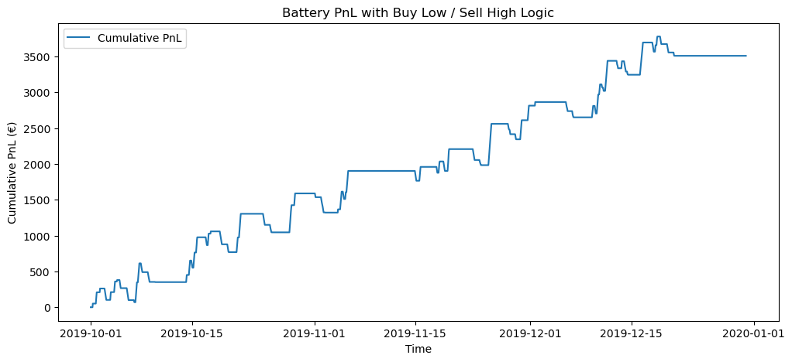

Battery Dispatch Optimization Project
Overview

This project demonstrates a battery trading strategy for intraday electricity markets using German (DE) price and generation data. The goal is to optimize battery operations to maximize profit by buying electricity when predicted prices are low and selling when predicted prices are high.

Data

The dataset includes hourly observations of:

DE_load_forecast_entsoe_transparency – Forecasted load in Germany

DE_solar_profile, DE_wind_onshore_profile – Share of solar and wind capacity generating electricity

DE_LU_price_day_ahead – Day-ahead electricity price (€/MWh)

DE_solar_generation_actual, DE_wind_onshore_generation_actual – Actual renewable generation

delta – Time difference between consecutive records

Derived features: residual_load, solar_forecast_MW, wind_forecast_MW

Data is preprocessed to:

Drop rows with all missing values

Fill remaining missing values using forward fill

Ensure hourly continuity

Modeling

Price Prediction:

XGBoost regression predicts the next-hour price using features such as forecasted load, renewable generation, and lagged prices.

Smoothed predictions (predicted_price_smooth) are used to reduce noise.

Battery Trading Logic:

Charge when predicted price is in the lowest 20% quantile (buy low)

Discharge when predicted price is in the highest 20% quantile (sell high)

Hold otherwise to reduce unnecessary trading

Battery constraints:

Maximum capacity: 10 MWh

Charge/discharge rate: 1 MW

Efficiency: 90%

PnL Calculation:

Profit/Loss per hour = energy traded (MWh) × price (€/MWh)

Cumulative PnL sums all hourly profits

Results

The simulation demonstrates battery operations and profitability over time.

State of Charge (SOC) tracks energy in the battery at each hour.

Cumulative PnL shows net profit generated by the strategy.

Example plot showing predicted price, SOC, and buy/sell actions for the first 24 hours.

Key Takeaways

Using forecasts allows anticipatory trading, not just reactive “buy low / sell high.”

SOC constraints and efficiency ensure realistic battery operations.

Strategy shows measurable value: e.g., €3,500 net profit over test period.

Visualizations help demonstrate how trading decisions map to battery state and market prices.

